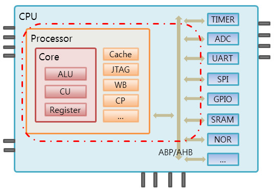

# ComputerArchitrecture

----
 

### [KOCW: 고려대학교] 컴퓨터구조 - 구건재 교수
 

----
## 목차

 - [컴퓨터 구조 소개 01-04](#컴퓨터-구조-소개)  
---
#
## 컴퓨터 구조 소개
#

### 01. clock frequency란 무엇인가요?    

- CPU clock frequency 는 CPU 동작 속도를 의미하고, '초당 사이클'을 의미한다.  
- (단위는 Hz) 사이클은 명령어가 요구하는 동작들을 수행하는 단위)
- 100Hz → 1초에 100개의 사이클을 수행 → 1개의 사이클을 수행하는데 걸리는 시간은 1/100 초    

---

### 02. processor란 무엇인가요?    

&nbsp;&nbsp;&nbsp;&nbsp;  

- 기본적인 **명령어들을 처리하는 논리회로**입니다
- 크게 소프트웨어의 신호를 받아 다른 하드웨어 부분으로 신호를 보내는 **제어장치(Control Unit)**와 사칙연산과 논리연산과 같은 연산을 담당하는 **연산장치(ALU, Arithmetic Logic Unit)**으로 구성됩니다
- 컴퓨터가 하는 일 모든 것을 총괄하는 것이 CPU라면, CPU를 보조하며 연산, 제어의 핵심부분을 담당하는 것이 프로세서입니다. 하지만 프로세서라는 용어는 점차적으로 CPU라는 용어를 대체하고 있습니다    

---

### 03. Cpu와 Gpu의 차이점은 무엇인가요?    

&nbsp;&nbsp;&nbsp;&nbsp;  

- GPU는 비디오, 즉 픽셀로 이루어진 영상을 처리하는 용도로 탄생했습니다. 이때문에 CPU에 비해 반복적이고 비슷한, 대량의 연산을 수행하며 이를 병렬적으로(Parallel) 나누어 작업하기 때문에 CPU에 비해 속도가 대단히 빠릅니다.
- CPU와 GPU의 차이는 그 작업 처리 방식을 비교해보면 쉽게 알 수 있습니다.
- 하나의 CPU는 직렬 처리에 최적화된 몇 개의 코어로 구성된 반면, GPU는 병렬 처리용으로 설계된 수 천 개의 보다 소형코어로 구성되었습니다    

---

### 04. 컴퓨터 작업 수행능력에 영향을 끼치는 요소는 어떤 것이 있나요?    

&nbsp;&nbsp;&nbsp;&nbsp;  

- 컴퓨터 퍼포먼스를 높이기 위해서는 SW,HW모두 성능을 높여야합니다 크게 4가지를 보자면
- **알고리즘**: 작업 수를 낮춤으로써 퍼포먼스를 증진시킵니다
- **프로그래밍 언어와 아키텍쳐**: 작업당 명령 수를 낮춤으로써 퍼포먼스를 증진시킵니다
- **프로세서와 메모리**: 피지컬적인 성능을 높입니다
- **OS**: 작업할당을 최대한 빠르고 효율적으로 처리함으로써 성능을 높입니다    

---

